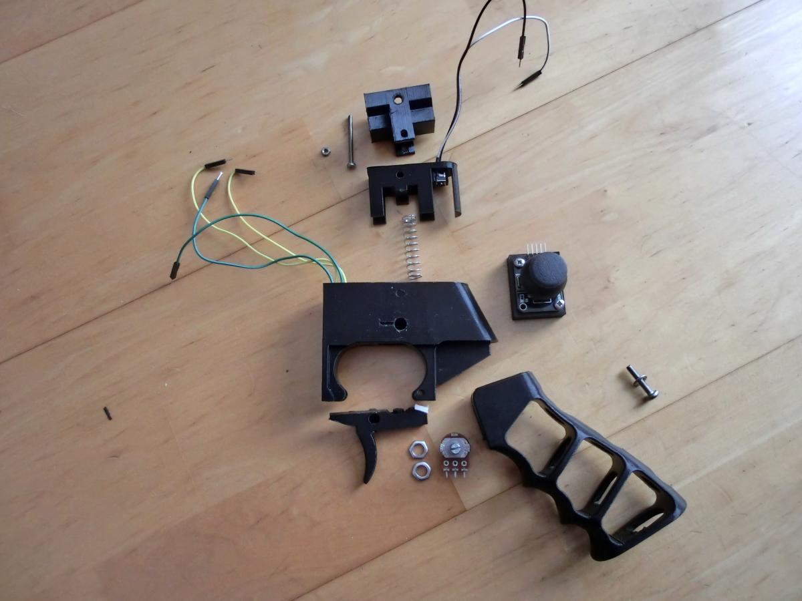
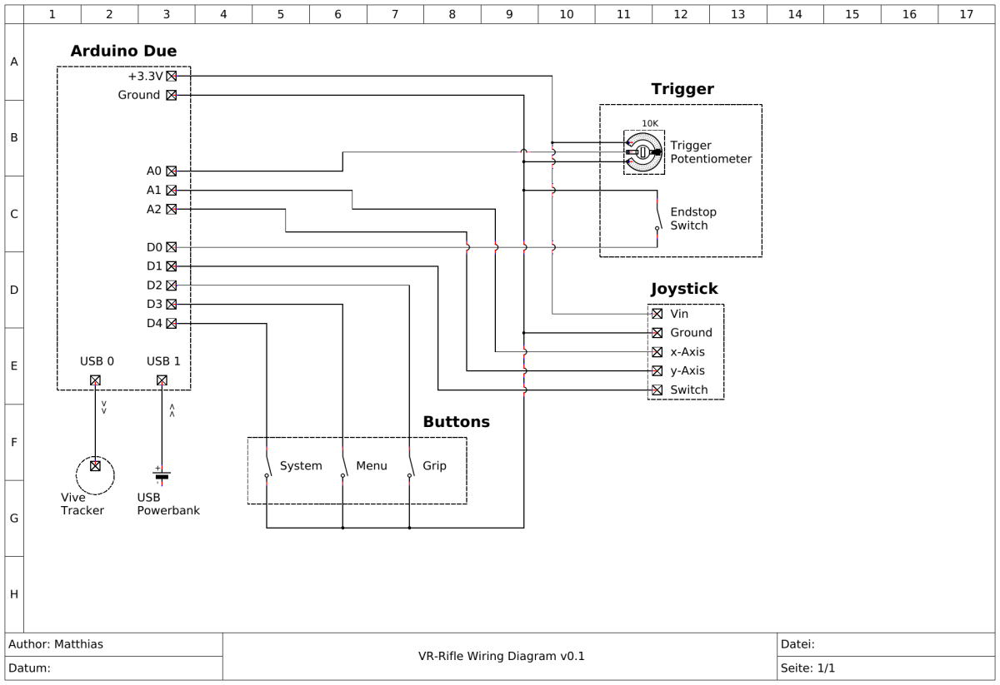
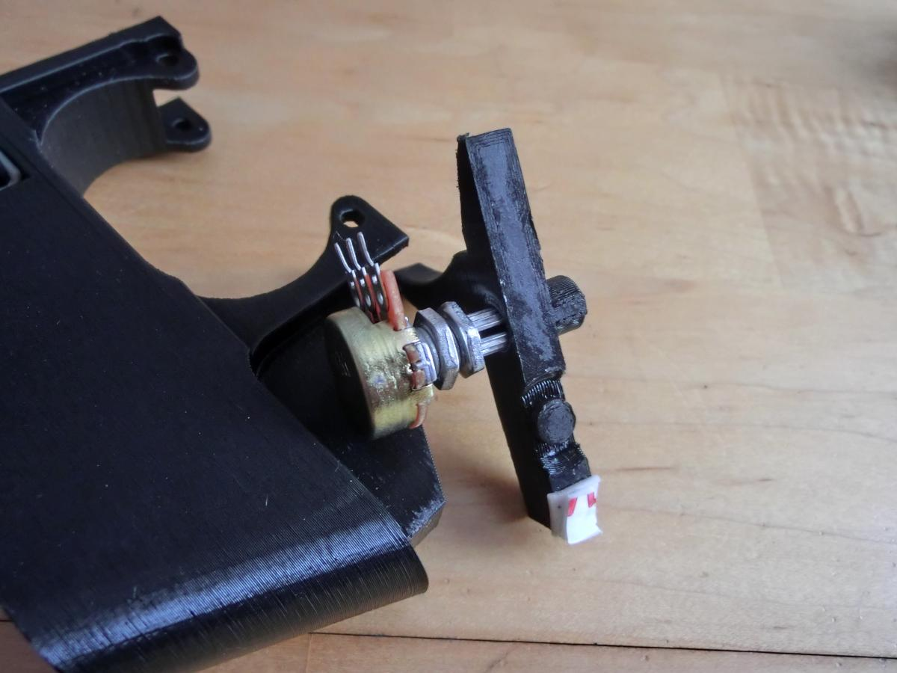
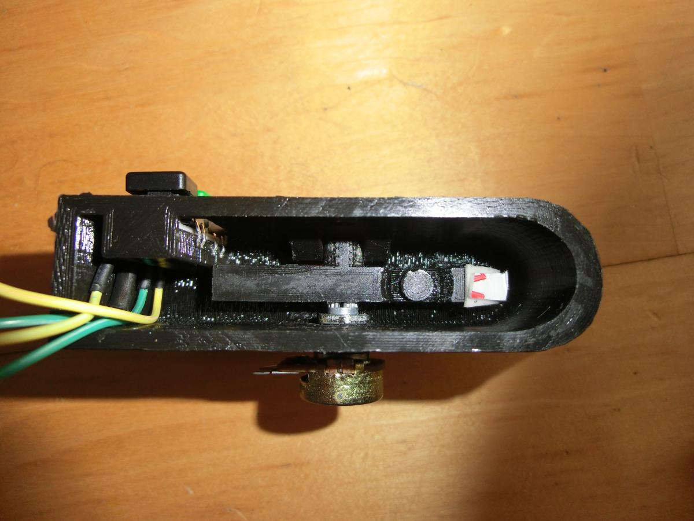
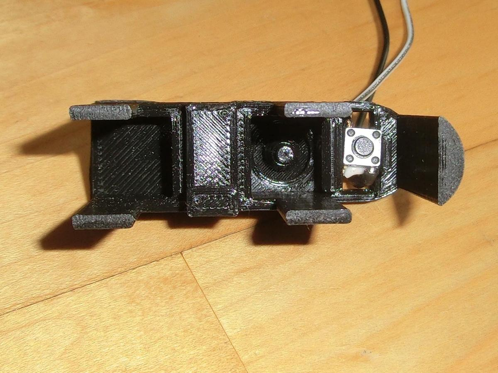
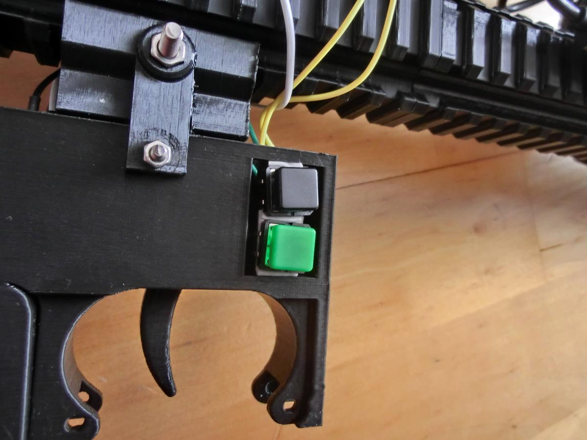

# DIY VR Rifle Blueprints

## Rifle Body

The rifle body is mainly based on the [MagHak Virtual Reality Rifle][1].

[1]: http://www.thingiverse.com/thing:1745148

### Main Body

- 3x VRR3a2 from the [MagHak Virtual Reality Rifle][1].
- 2x M4x32 scews (M4x25 screws should also work)

### Stock (AR 15 style)

- [AR 15 buffer tube (commercial variant)](http://www.thingiverse.com/thing:2153340).
- [Collapsible AR15 Hex Stock](http://www.thingiverse.com/thing:2153340) (I had to scale it to 104% to nicely fit the buffer tube).
- Spring (diameter: 8mm, length: 30mm), M4x40 screw and M4 nut for release lever.
- [Adapter to connect buffer tube to main body](AR15-Stock-Parts/AR15-Stock-Adapter.stl).
  - based on VRR3e2 piece from [MagHak Virtual Reality Rifle][1] (modified to nicely fit the buffer tube).
- M4x32 screw and M4 nut for adapter

#### Alternatives

- The [original MagHak Virtual Reality Rifle][1] has two alternative stocks.
- The [Oculus Remix](http://www.thingiverse.com/thing:2057419) also has an alternative stock.

### Receiver

The receiver consists of six parts:

- [Receiver housing](VR-Rifle-Receiver/VRRifle-Receiver-Housing.stl).
- [Receiver inlay](VR-Rifle-Receiver/VRRifle-Receiver-Inlay.stl).
- [Trigger](VR-Rifle-Receiver/VRRifle-Receiver-Trigger.stl).
- [Receiver rail adapter](VR-Rifle-Receiver/VRRifle-Receiver-RailAdapter.stl).
- [Skeleton Grip](VR-Rifle-Receiver/VRRifle-Receiver-SkeletonGrip.stl).
- [Joystick mount](VR-Rifle-Receiver/VRRifle-Receiver-JoystickMount.stl).
- M4x20 screw to attach grip.
- M3x35 screw and M3 nut to connect housing, inlay and rail adapter together.
- Spring with diameter 9mm and length 38mm between inlay and trigger.

### Vive Tracker Mount

The Vive tracker mount features a side-tightening wheel and consists of three parts:

- [Upper body](Vive-Tracker-Adapter/ViveTrackerAdapter-UpperBody.stl).
- [Screw with wheel](Vive-Tracker-Adapter/ViveTrackerAdapter-Screw.stl).
- [Lower body with rail adapter](Vive-Tracker-Adapter/ViveTrackerAdapter-LowerBodyRail.stl).
- 4x M4x6 screws.

### Arduino Mount

ToDo: Create a proper mount for the Arduino board.

Makeshift mount:

- VRRb3 piece from [MagHak Virtual Reality Rifle][1].
  - Cut away the pins with pliers and attach Arduino board with double-sided adhesive tape.

## Electronic Parts

There are six components:
- Arduino board
- Triggger
- Joystick
- Buttons
- Vive traker
- Power source

### Arduino Board (Arduino Due)

The Arduino board has to support USB host mode to be able to talk to the Vive tracker. The Arduino AVR boards do not support USB host mode out-of-the-box but require additional hardware. The Arduino Due is ARM based and does support USB host mode. THerefore we are using it. The disadvantage is that it operates using 3.3V instead of 5V.

### Trigger

The trigger features a potentiometer to measure how far the trigger is pulled, and an endstop switch for when the trigger reaches it maximal position.

Parts:
- [10K Potentiometer from this kit](https://www.amazon.de/gp/product/B00MHUCYZA/ref=oh_aui_detailpage_o01_s00?ie=UTF8&psc=1).
- [Switch from this kit](https://www.amazon.de/gp/product/B01J79YG8G/ref=oh_aui_detailpage_o01_s01?ie=UTF8&psc=1).

Trigger Potentiometer:

Trigger Potentiometer 2:

Trigger Endstop:

### Joystick

- [Joystick module for Arduino](https://www.amazon.de/gp/product/B01IA4QWFO/ref=oh_aui_detailpage_o01_s01?ie=UTF8&psc=1).

### Buttons

Parts:
- [Big buttons with cover from this kit](https://www.amazon.de/gp/product/B00MHUCYZA/ref=oh_aui_detailpage_o01_s00?ie=UTF8&psc=1)

The system and menu buttons are mounted inside the opening of the receiver housing. The grip button is supposed to be mounted somewhere on the grip, but it has not been desided yet where exactly.

### Power Source

The easiest and cheapest power source seems to be a USB power bank. The Arduino board and connected electronic parts consume about 100-200 mA, with connected Vive tracker about 300-400 mA (possible charging bug?). A USB power bank with 2200 mAh costs about 10 Euro and should last about 5-6 hours.

### Possible Extensions

- **Status LED(s)**
- **Haptic Feedback**: Haptic feedback events are not send via USB but can only be accessed via the tracker's pogo pins. 
